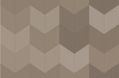
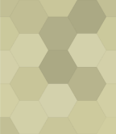
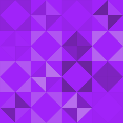
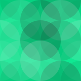
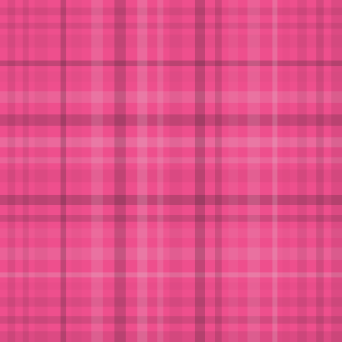
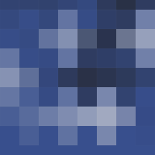
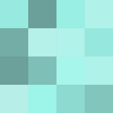
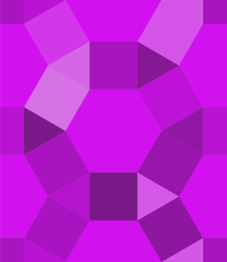
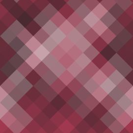

# geopattern

  

This has been rewritten to be leaner and actually usable.

The sha1 stuff is out, now essentially a bunch of functions that return `svg::Document`.

In the cleanup, removed error handling and now the code has a bunch of `assert_eq!` calls. Maybe reconsider that.

### Chevrons

### Concentric Circles

### Diamonds

### Hexagons

### Mosaic Squares

### Nested Squares

### Octagons

### Overlapping Circles

### Overlapping Rings

### Plaid

### Plus Signs

### Sine Waves

### Squares

### Tesselation

### Tiled Lines

### Triangles

### Xes

## License

geopattern-rs is distributed under the terms of both the MIT license and the
Apache License (Version 2.0).

See [LICENSE-APACHE](LICENSE-APACHE) and [LICENSE-MIT](LICENSE-MIT) for details.
